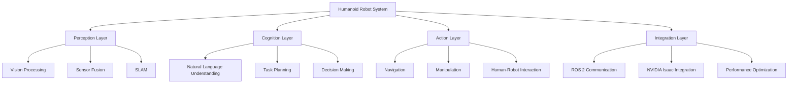

# Capstone Implementation Guide

## Introduction

This guide provides a systematic approach to implementing the autonomous humanoid robot system for your capstone project. It breaks down the complex task into manageable phases, with clear milestones and validation steps at each stage.

## Phase 1: System Architecture and Design

### 1.1 Requirements Analysis

Before beginning implementation, clearly define your system requirements:

```bash
# Create requirements document
mkdir -p ~/capstone_project/docs
touch ~/capstone_project/docs/requirements.md
```

Document the following requirements:
- Functional requirements (what the robot should do)
- Performance requirements (response times, accuracy, etc.)
- Environmental requirements (operating conditions)
- Safety requirements (fail-safe mechanisms)

### 1.2 System Architecture Design

Design your system architecture following ROS 2 best practices:



### 1.3 Component Planning

Plan your ROS 2 nodes and their interactions:

```python
# Example node structure
class CapstoneSystem:
    def __init__(self):
        # Perception nodes
        self.vision_node = VisionProcessingNode()
        self.slam_node = SLAMNode()

        # Cognition nodes
        self.nlu_node = NaturalLanguageUnderstandingNode()
        self.planning_node = TaskPlanningNode()

        # Action nodes
        self.navigation_node = NavigationNode()
        self.manipulation_node = ManipulationNode()

        # Integration layer
        self.system_manager = SystemManagerNode()
```

## Phase 2: Component Implementation

### 2.1 Vision Processing Implementation

Implement your vision processing system using the concepts from Module 4:

```python
import rclpy
from rclpy.node import Node
from sensor_msgs.msg import Image, CameraInfo
from vision_msgs.msg import Detection2DArray
from cv_bridge import CvBridge
import cv2
import numpy as np
import torch

class VisionProcessingNode(Node):
    def __init__(self):
        super().__init__('vision_processing_node')

        # Initialize CvBridge
        self.bridge = CvBridge()

        # Publishers and subscribers
        self.image_sub = self.create_subscription(
            Image,
            '/camera/image_raw',
            self.image_callback,
            10
        )

        self.camera_info_sub = self.create_subscription(
            CameraInfo,
            '/camera/camera_info',
            self.camera_info_callback,
            10
        )

        self.detection_pub = self.create_publisher(
            Detection2DArray,
            '/vision/detections',
            10
        )

        # Initialize vision models
        self.vision_model = self.initialize_vision_model()
        self.camera_info = None

        self.get_logger().info('Vision Processing Node initialized')

    def initialize_vision_model(self):
        """Initialize deep learning vision model."""
        # Load your pre-trained model here
        # This could be a YOLO model, segmentation model, etc.
        pass

    def camera_info_callback(self, msg):
        """Store camera calibration information."""
        self.camera_info = msg

    def image_callback(self, msg):
        """Process incoming image and publish detections."""
        try:
            # Convert ROS image to OpenCV
            cv_image = self.bridge.imgmsg_to_cv2(msg, 'bgr8')

            # Perform vision processing
            detections = self.process_image(cv_image)

            # Publish results
            self.publish_detections(detections, msg.header)

        except Exception as e:
            self.get_logger().error(f'Error processing image: {str(e)}')

    def process_image(self, image):
        """Perform vision processing on the input image."""
        # Implement your vision processing logic here
        # This could include object detection, segmentation, etc.
        pass

    def publish_detections(self, detections, header):
        """Publish detection results as ROS 2 messages."""
        detection_array = Detection2DArray()
        detection_array.header = header

        # Process and publish detections
        for detection in detections:
            detection_msg = Detection2D()
            # Set detection properties
            detection_array.detections.append(detection_msg)

        self.detection_pub.publish(detection_array)
```

### 2.2 Natural Language Understanding Implementation

Implement your NLU system using concepts from Module 4:

```python
import rclpy
from rclpy.node import Node
from std_msgs.msg import String
from geometry_msgs.msg import Twist
from builtin_interfaces.msg import Duration

class NaturalLanguageUnderstandingNode(Node):
    def __init__(self):
        super().__init__('nlu_node')

        # Publishers and subscribers
        self.command_sub = self.create_subscription(
            String,
            '/voice_commands',
            self.command_callback,
            10
        )

        self.task_pub = self.create_publisher(
            String,
            '/planned_tasks',
            10
        )

        # Initialize NLU model
        self.nlu_model = self.initialize_nlu_model()

        self.get_logger().info('Natural Language Understanding Node initialized')

    def initialize_nlu_model(self):
        """Initialize natural language understanding model."""
        # Load your NLU model here
        # This could be a transformer model, rule-based system, etc.
        pass

    def command_callback(self, msg):
        """Process natural language commands."""
        try:
            command_text = msg.data
            parsed_command = self.parse_command(command_text)

            # Publish parsed command to task planner
            task_msg = String()
            task_msg.data = parsed_command
            self.task_pub.publish(task_msg)

        except Exception as e:
            self.get_logger().error(f'Error processing command: {str(e)}')

    def parse_command(self, command_text):
        """Parse natural language command into structured format."""
        # Implement your command parsing logic here
        # Convert natural language to structured task
        pass
```

### 2.3 Navigation System Implementation

Implement your navigation system using Navigation2 and Isaac:

```python
import rclpy
from rclpy.node import Node
from geometry_msgs.msg import PoseStamped
from nav2_msgs.action import NavigateToPose
from rclpy.action import ActionClient

class NavigationNode(Node):
    def __init__(self):
        super().__init__('navigation_node')

        # Action client for navigation
        self.nav_client = ActionClient(
            self,
            NavigateToPose,
            'navigate_to_pose'
        )

        # Publisher for navigation goals
        self.goal_pub = self.create_publisher(
            PoseStamped,
            '/goal_pose',
            10
        )

        self.get_logger().info('Navigation Node initialized')

    def send_navigation_goal(self, x, y, theta):
        """Send navigation goal to Navigation2."""
        while not self.nav_client.wait_for_server(timeout_sec=1.0):
            self.get_logger().info('Navigation server not available, waiting...')

        goal_msg = NavigateToPose.Goal()
        goal_msg.pose.header.frame_id = 'map'
        goal_msg.pose.pose.position.x = x
        goal_msg.pose.pose.position.y = y
        goal_msg.pose.pose.orientation.z = theta

        self.nav_client.send_goal_async(goal_msg)
```

### 2.4 Manipulation System Implementation

Implement your manipulation system:

```python
import rclpy
from rclpy.node import Node
from geometry_msgs.msg import Pose
from std_msgs.msg import String
from trajectory_msgs.msg import JointTrajectory

class ManipulationNode(Node):
    def __init__(self):
        super().__init__('manipulation_node')

        # Publishers for manipulation commands
        self.joint_pub = self.create_publisher(
            JointTrajectory,
            '/joint_trajectory_controller/joint_trajectory',
            10
        )

        self.ee_pose_pub = self.create_publisher(
            Pose,
            '/end_effector_pose',
            10
        )

        self.get_logger().info('Manipulation Node initialized')

    def move_to_pose(self, target_pose):
        """Move manipulator to target pose."""
        # Implement inverse kinematics and trajectory planning
        pass

    def grasp_object(self, object_pose):
        """Execute grasping maneuver."""
        # Implement grasping logic
        pass
```

## Phase 3: System Integration

### 3.1 Integration Framework

Create a system manager to coordinate all components:

```python
import rclpy
from rclpy.node import Node
from std_msgs.msg import String
from geometry_msgs.msg import PoseStamped
from sensor_msgs.msg import Image

class SystemManagerNode(Node):
    def __init__(self):
        super().__init__('system_manager')

        # Subscribers for system status
        self.status_sub = self.create_subscription(
            String,
            '/system_status',
            self.status_callback,
            10
        )

        # Publishers for system commands
        self.command_pub = self.create_publisher(
            String,
            '/system_commands',
            10
        )

        # Initialize safety monitor
        self.safety_monitor = SafetyMonitor()

        self.get_logger().info('System Manager Node initialized')

    def status_callback(self, msg):
        """Handle system status updates."""
        # Monitor system health and safety
        pass

class SafetyMonitor:
    def __init__(self):
        self.emergency_stop = False
        self.safety_zones = []

    def check_safety(self):
        """Check system safety status."""
        # Implement safety checks
        return not self.emergency_stop
```

### 3.2 Isaac Integration

Integrate NVIDIA Isaac components for GPU acceleration:

```python
# Isaac ROS integration
import rclpy
from rclpy.node import Node
from sensor_msgs.msg import Image
from isaac_ros_visual_slam_msgs.msg import VisualSlamStatus
from cv_bridge import CvBridge

class IsaacIntegrationNode(Node):
    def __init__(self):
        super().__init__('isaac_integration_node')

        # Publishers and subscribers for Isaac components
        self.image_sub = self.create_subscription(
            Image,
            '/camera/image_raw',
            self.isaac_image_callback,
            10
        )

        # Initialize Isaac components
        self.initialize_isaac_components()

        self.get_logger().info('Isaac Integration Node initialized')

    def initialize_isaac_components(self):
        """Initialize Isaac GPU-accelerated components."""
        # Initialize Isaac visual slam, perception, etc.
        pass

    def isaac_image_callback(self, msg):
        """Process image using Isaac GPU-accelerated pipelines."""
        # Use Isaac components for processing
        pass
```

## Phase 4: Testing and Validation

### 4.1 Unit Testing

Create unit tests for each component:

```python
import unittest
import rclpy
from rclpy.executors import SingleThreadedExecutor
from vision_processing_node import VisionProcessingNode
from nlu_node import NaturalLanguageUnderstandingNode

class TestVisionProcessing(unittest.TestCase):
    def setUp(self):
        rclpy.init()
        self.node = VisionProcessingNode()
        self.executor = SingleThreadedExecutor()
        self.executor.add_node(self.node)

    def tearDown(self):
        self.node.destroy_node()
        rclpy.shutdown()

    def test_image_processing(self):
        # Test image processing functionality
        pass

class TestNLU(unittest.TestCase):
    def setUp(self):
        rclpy.init()
        self.node = NaturalLanguageUnderstandingNode()
        self.executor = SingleThreadedExecutor()
        self.executor.add_node(self.node)

    def tearDown(self):
        self.node.destroy_node()
        rclpy.shutdown()

    def test_command_parsing(self):
        # Test command parsing functionality
        pass
```

### 4.2 Integration Testing

Test the integrated system:

```python
import unittest
import rclpy
from rclpy.executors import SingleThreadedExecutor

class TestIntegratedSystem(unittest.TestCase):
    def setUp(self):
        rclpy.init()

        # Initialize all system components
        self.vision_node = VisionProcessingNode()
        self.nlu_node = NaturalLanguageUnderstandingNode()
        self.nav_node = NavigationNode()
        self.manip_node = ManipulationNode()
        self.system_node = SystemManagerNode()

        self.executor = SingleThreadedExecutor()
        self.executor.add_node(self.vision_node)
        self.executor.add_node(self.nlu_node)
        self.executor.add_node(self.nav_node)
        self.executor.add_node(self.manip_node)
        self.executor.add_node(self.system_node)

    def tearDown(self):
        # Clean up all nodes
        self.vision_node.destroy_node()
        self.nlu_node.destroy_node()
        self.nav_node.destroy_node()
        self.manip_node.destroy_node()
        self.system_node.destroy_node()
        rclpy.shutdown()

    def test_end_to_end_workflow(self):
        """Test complete end-to-end workflow."""
        # Test complete workflow from command to action
        pass
```

## Phase 5: Performance Optimization

### 5.1 GPU Acceleration

Optimize using NVIDIA Isaac GPU acceleration:

```python
# Performance optimization configuration
import rclpy
from rclpy.node import Node

class PerformanceOptimizerNode(Node):
    def __init__(self):
        super().__init__('performance_optimizer')

        # Configure GPU acceleration
        self.configure_gpu_acceleration()

        # Monitor performance metrics
        self.performance_monitor = PerformanceMonitor()

        self.get_logger().info('Performance Optimizer Node initialized')

    def configure_gpu_acceleration(self):
        """Configure GPU acceleration for optimal performance."""
        # Set up CUDA contexts, optimize memory usage, etc.
        pass
```

### 5.2 Memory and Resource Management

Implement efficient resource management:

```python
class ResourceManager:
    def __init__(self):
        self.memory_limit = 8 * 1024 * 1024 * 1024  # 8GB
        self.gpu_memory_limit = 6 * 1024 * 1024 * 1024  # 6GB
        self.cpu_usage_limit = 0.8  # 80% CPU usage limit

    def monitor_resources(self):
        """Monitor system resource usage."""
        # Implement resource monitoring
        pass

    def optimize_resources(self):
        """Optimize resource usage."""
        # Implement resource optimization strategies
        pass
```

## Best Practices and Guidelines

### Code Quality
- Follow ROS 2 style guidelines
- Use meaningful variable and function names
- Include comprehensive documentation
- Implement proper error handling
- Use version control (git) for code management

### System Design
- Design modular, reusable components
- Implement proper separation of concerns
- Use design patterns where appropriate
- Plan for scalability and maintainability
- Consider safety and reliability from the start

### Testing
- Write unit tests for all components
- Perform integration testing regularly
- Test edge cases and error conditions
- Validate performance under load
- Test safety mechanisms

### Documentation
- Document all major components
- Include API documentation
- Create system architecture diagrams
- Maintain user guides
- Document troubleshooting procedures

## Troubleshooting Common Issues

### Performance Issues
- Monitor CPU and GPU usage
- Optimize memory allocation
- Use efficient data structures
- Consider multi-threading where appropriate

### Integration Issues
- Verify message formats and types
- Check network connectivity
- Validate QoS settings
- Monitor system logs

### Hardware Issues
- Verify sensor calibration
- Check power requirements
- Monitor thermal conditions
- Validate communication interfaces

## Next Steps

After completing this implementation guide:

1. Review and refine your system architecture
2. Conduct thorough testing and validation
3. Optimize performance based on testing results
4. Prepare for the final demonstration
5. Document your system design and implementation process

## Cross-References

This implementation builds on concepts from throughout the curriculum:
- [Week 1-3: ROS 2 Foundations](/docs/modules/module-1-ros-foundations/) - for the communication architecture
- [Week 4-5: Simulation Basics](/docs/modules/module-2-gazebo-unity/) - for testing environments
- [Week 6-7: Isaac Platform](/docs/module-3-nvidia-isaac/) - for GPU acceleration
- [Week 8-13: VLA Systems](/docs/modules/module-4-vla-systems/) - for perception and action integration
- [Week 14: System Integration](/docs/modules/module-4-vla-systems/week-14-system-integration.md) - for final integration concepts