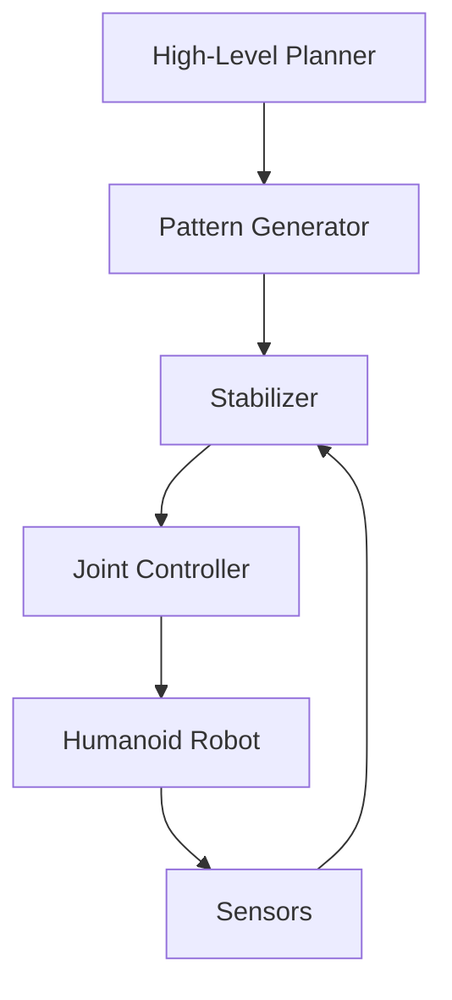

# Week 10: Humanoid Robot Control Systems

## Learning Objectives

By the end of this week, students will be able to:
- Explain the unique challenges of controlling humanoid robots compared to wheeled or simpler robots
- Implement balance control algorithms for humanoid robots
- Design locomotion patterns for bipedal walking
- Integrate perception systems with humanoid control for stable operation
- Apply safety considerations in humanoid robot control

## Overview

Humanoid robot control represents one of the most challenging areas in robotics, requiring sophisticated algorithms to maintain balance, coordinate multiple degrees of freedom, and achieve stable locomotion. This week explores the fundamental principles and practical implementations of humanoid robot control systems, building on the perception and integration concepts learned in previous weeks.

## Fundamentals of Humanoid Control

### Challenges in Humanoid Control

Humanoid robots present unique control challenges due to their:

1. **Dynamic Instability**: Unlike wheeled robots, humanoid robots are inherently unstable and require active balance control
2. **High Degrees of Freedom**: Multiple joints require coordinated control for stable movement
3. **Real-time Requirements**: Balance and locomotion require high-frequency control updates
4. **Complex Kinematics**: Both forward and inverse kinematics are complex for multi-limb systems
5. **Environmental Interaction**: Safe interaction with the environment while maintaining balance


*Figure 5: Humanoid robot showing the complex multi-joint system and control challenges involved in maintaining balance and locomotion.*

### Control Architecture

The typical control architecture for humanoid robots includes multiple layers:



## Balance Control

### Zero Moment Point (ZMP)

The Zero Moment Point (ZMP) is a critical concept in humanoid balance control:

- **Definition**: The point on the ground where the net moment of the ground reaction force is zero
- **Stability**: For stable walking, the ZMP must remain within the support polygon
- **Control**: ZMP-based controllers generate stable walking patterns

```python
import numpy as np

def calculate_zmp_forces(cop_x, cop_y, f_z, tau_x, tau_y):
    """
    Calculate ZMP (Zero Moment Point) coordinates from force/torque measurements.

    Args:
        cop_x, cop_y: Center of pressure coordinates
        f_z: Vertical force
        tau_x, tau_y: Torque around x and y axes

    Returns:
        zmp_x, zmp_y: ZMP coordinates
    """
    if f_z == 0:
        return cop_x, cop_y

    zmp_x = cop_x - tau_y / f_z
    zmp_y = cop_y + tau_x / f_z

    return zmp_x, zmp_y

def check_stability(zmp_x, zmp_y, support_polygon):
    """
    Check if ZMP is within the support polygon for stability.

    Args:
        zmp_x, zmp_y: ZMP coordinates
        support_polygon: List of (x, y) coordinates defining support polygon

    Returns:
        bool: True if stable, False otherwise
    """
    # Simple implementation for rectangular support polygon
    min_x = min([p[0] for p in support_polygon])
    max_x = max([p[0] for p in support_polygon])
    min_y = min([p[1] for p in support_polygon])
    max_y = max([p[1] for p in support_polygon])

    return min_x <= zmp_x <= max_x and min_y <= zmp_y <= max_y
```

### Center of Mass Control

Maintaining the center of mass (CoM) within stable regions is crucial:

```python
class CenterOfMassController:
    def __init__(self, robot_mass, gravity=9.81):
        self.mass = robot_mass
        self.gravity = gravity
        self.com_position = np.array([0.0, 0.0, 0.0])
        self.com_velocity = np.array([0.0, 0.0, 0.0])
        self.com_acceleration = np.array([0.0, 0.0, 0.0])

    def update_com_state(self, joint_positions, joint_velocities):
        """Update center of mass state based on joint configuration."""
        # Calculate CoM position using kinematic model
        self.com_position = self.calculate_com_position(joint_positions)
        self.com_velocity = self.calculate_com_velocity(joint_velocities)

    def calculate_com_position(self, joint_positions):
        """Calculate center of mass position from joint positions."""
        # Implementation depends on robot kinematic model
        pass

    def calculate_com_velocity(self, joint_velocities):
        """Calculate center of mass velocity from joint velocities."""
        # Implementation depends on robot kinematic model
        pass

    def compute_balance_forces(self, desired_com_position, current_com_position, kp=100.0, kd=20.0):
        """Compute forces needed to maintain balance."""
        position_error = desired_com_position - current_com_position
        force = kp * position_error + kd * self.com_velocity
        return force
```

## Locomotion Control

### Walking Pattern Generation

Generating stable walking patterns requires careful planning:

```python
class WalkingPatternGenerator:
    def __init__(self, step_length=0.3, step_height=0.1, step_duration=1.0):
        self.step_length = step_length
        self.step_height = step_height
        self.step_duration = step_duration
        self.support_foot = "left"  # or "right"

    def generate_step_trajectory(self, start_position, direction="forward"):
        """Generate trajectory for a single step."""
        t = np.linspace(0, self.step_duration, 50)  # 50 points over step duration

        # Generate foot trajectory
        if direction == "forward":
            x_trajectory = start_position[0] + self.step_length * (t / self.step_duration)
        elif direction == "backward":
            x_trajectory = start_position[0] - self.step_length * (t / self.step_duration)
        elif direction == "left":
            y_trajectory = start_position[1] + self.step_length * (t / self.step_duration)
        elif direction == "right":
            y_trajectory = start_position[1] - self.step_length * (t / self.step_duration)
        else:
            x_trajectory = np.full_like(t, start_position[0])
            y_trajectory = np.full_like(t, start_position[1])

        # Generate vertical trajectory for step height
        z_trajectory = np.full_like(t, start_position[2])
        if direction in ["forward", "backward", "left", "right"]:
            # Add parabolic trajectory for step height
            mid_idx = len(t) // 2
            z_trajectory[:mid_idx] = start_position[2] + self.step_height * np.sin(
                np.pi * t[:mid_idx] / (2 * t[mid_idx])
            )
            z_trajectory[mid_idx:] = start_position[2] + self.step_height * np.sin(
                np.pi * (t[mid_idx:] - t[mid_idx]) / (2 * (t[-1] - t[mid_idx]))
            )

        return np.column_stack([x_trajectory, y_trajectory, z_trajectory])

    def generate_walk_sequence(self, num_steps, direction="forward"):
        """Generate sequence of steps for walking."""
        trajectories = []
        current_position = np.array([0.0, 0.0, 0.0])

        for i in range(num_steps):
            step_trajectory = self.generate_step_trajectory(current_position, direction)
            trajectories.append(step_trajectory)

            # Update current position for next step
            if direction == "forward":
                current_position[0] += self.step_length
            elif direction == "backward":
                current_position[0] -= self.step_length
            elif direction == "left":
                current_position[1] += self.step_length
            elif direction == "right":
                current_position[1] -= self.step_length

            # Switch support foot
            self.support_foot = "right" if self.support_foot == "left" else "left"

        return trajectories
```

### Inverse Kinematics for Walking

Solving inverse kinematics for humanoid walking:

```python
import numpy as np
from scipy.optimize import minimize

class HumanoidIKSolver:
    def __init__(self, robot_model):
        self.robot_model = robot_model
        self.joint_limits = robot_model.joint_limits

    def solve_leg_ik(self, target_position, target_orientation, leg_chain, current_joint_angles):
        """
        Solve inverse kinematics for a leg to reach target position and orientation.

        Args:
            target_position: Desired foot position [x, y, z]
            target_orientation: Desired foot orientation as quaternion [w, x, y, z]
            leg_chain: Kinematic chain for the leg
            current_joint_angles: Current joint angles as initial guess

        Returns:
            joint_angles: Solution for joint angles
        """
        def objective_function(joint_angles):
            # Calculate current end-effector pose
            current_pose = self.robot_model.calculate_forward_kinematics(
                leg_chain, joint_angles
            )

            # Calculate position error
            pos_error = np.linalg.norm(
                np.array(target_position) - np.array(current_pose.position)
            )

            # Calculate orientation error
            # Convert to quaternions and calculate angular error
            target_quat = target_orientation
            current_quat = current_pose.orientation
            orientation_error = self.quaternion_distance(target_quat, current_quat)

            return pos_error + 0.1 * orientation_error  # Weight orientation less than position

        # Add joint limits as constraints
        constraints = []
        for i, (lower, upper) in enumerate(self.joint_limits):
            constraints.append({'type': 'ineq', 'fun': lambda x, i=i, lower=lower: x[i] - lower})
            constraints.append({'type': 'ineq', 'fun': lambda x, i=i, upper=upper: upper - x[i]})

        # Solve optimization problem
        result = minimize(
            objective_function,
            current_joint_angles,
            method='SLSQP',
            constraints=constraints
        )

        return result.x if result.success else current_joint_angles

    def quaternion_distance(self, q1, q2):
        """Calculate angular distance between two quaternions."""
        # Ensure quaternions are normalized
        q1 = q1 / np.linalg.norm(q1)
        q2 = q2 / np.linalg.norm(q2)

        # Calculate dot product
        dot = np.abs(np.dot(q1, q2))

        # Calculate angle
        angle = 2 * np.arccos(min(1.0, dot))
        return angle
```

## Integration with ROS 2

### Humanoid Control Node

Implementing a ROS 2 node for humanoid control:

```python
import rclpy
from rclpy.node import Node
from sensor_msgs.msg import JointState
from geometry_msgs.msg import Pose, Twist
from std_msgs.msg import Float64MultiArray
from trajectory_msgs.msg import JointTrajectory, JointTrajectoryPoint
import numpy as np

class HumanoidControllerNode(Node):
    def __init__(self):
        super().__init__('humanoid_controller')

        # Publishers and subscribers
        self.joint_state_sub = self.create_subscription(
            JointState,
            '/joint_states',
            self.joint_state_callback,
            10
        )

        self.trajectory_pub = self.create_publisher(
            JointTrajectory,
            '/joint_trajectory_controller/joint_trajectory',
            10
        )

        self.com_pub = self.create_publisher(
            Pose,
            '/center_of_mass',
            10
        )

        self.zmp_pub = self.create_publisher(
            Pose,
            '/zmp',
            10
        )

        # Initialize controllers
        self.com_controller = CenterOfMassController(robot_mass=30.0)  # Example mass
        self.walk_generator = WalkingPatternGenerator()
        self.ik_solver = HumanoidIKSolver(robot_model=None)  # Placeholder

        # Control timer
        self.control_timer = self.create_timer(0.01, self.control_loop)  # 100 Hz

        self.joint_positions = None
        self.joint_velocities = None

        self.get_logger().info('Humanoid Controller Node initialized')

    def joint_state_callback(self, msg):
        """Update joint state information."""
        self.joint_positions = np.array(msg.position)
        self.joint_velocities = np.array(msg.velocity)

        # Update center of mass state
        if self.joint_positions is not None and self.joint_velocities is not None:
            self.com_controller.update_com_state(
                self.joint_positions,
                self.joint_velocities
            )

    def control_loop(self):
        """Main control loop running at 100 Hz."""
        if self.joint_positions is None:
            return

        # Calculate current center of mass
        current_com = self.com_controller.com_position
        com_msg = Pose()
        com_msg.position.x = current_com[0]
        com_msg.position.y = current_com[1]
        com_msg.position.z = current_com[2]
        self.com_pub.publish(com_msg)

        # Calculate ZMP (simplified)
        zmp_msg = Pose()
        zmp_msg.position.x = current_com[0]  # Simplified ZMP calculation
        zmp_msg.position.y = current_com[1]
        zmp_msg.position.z = 0.0
        self.zmp_pub.publish(zmp_msg)

        # Generate walking trajectory if in walking mode
        # This would be triggered by higher-level commands
        pass

    def generate_walk_trajectory(self, steps, direction="forward"):
        """Generate walking trajectory for the specified number of steps."""
        trajectories = self.walk_generator.generate_walk_sequence(steps, direction)

        # Convert to ROS JointTrajectory message
        trajectory_msg = JointTrajectory()
        trajectory_msg.joint_names = self.get_joint_names()  # Implement this method

        for step_idx, step_trajectory in enumerate(trajectories):
            for point_idx, position in enumerate(step_trajectory):
                point = JointTrajectoryPoint()
                # Calculate joint angles for this position using IK
                joint_angles = self.ik_solver.solve_leg_ik(
                    position, [1, 0, 0, 0], "left_leg", self.joint_positions
                )
                point.positions = joint_angles
                point.time_from_start.sec = int(step_idx * self.walk_generator.step_duration +
                                              point_idx * 0.02)  # 50 Hz
                point.time_from_start.nanosec = int((step_idx * self.walk_generator.step_duration +
                                                   point_idx * 0.02 -
                                                   int(step_idx * self.walk_generator.step_duration +
                                                       point_idx * 0.02)) * 1e9)
                trajectory_msg.points.append(point)

        return trajectory_msg

    def get_joint_names(self):
        """Return list of joint names for the humanoid robot."""
        # This should return the actual joint names for your robot
        return ["left_hip", "left_knee", "left_ankle", "right_hip", "right_knee", "right_ankle"]
```

## Safety Considerations

### Emergency Stop Systems

Implementing safety mechanisms is critical for humanoid robots:

```python
class SafetyMonitor:
    def __init__(self, controller_node):
        self.controller = controller_node
        self.emergency_stop = False
        self.safety_limits = {
            'max_joint_velocity': 5.0,  # rad/s
            'max_joint_torque': 100.0,  # Nm
            'max_com_velocity': 1.0,    # m/s
            'max_angular_velocity': 1.5 # rad/s
        }

    def check_safety(self, joint_states, com_state):
        """Check if current state is within safety limits."""
        if joint_states is None or com_state is None:
            return False

        # Check joint velocities
        for vel in joint_states.velocity:
            if abs(vel) > self.safety_limits['max_joint_velocity']:
                self.trigger_emergency_stop("Joint velocity limit exceeded")
                return False

        # Check COM velocity
        com_vel = np.linalg.norm(com_state.velocity)
        if com_vel > self.safety_limits['max_com_velocity']:
            self.trigger_emergency_stop("COM velocity limit exceeded")
            return False

        return True

    def trigger_emergency_stop(self, reason):
        """Trigger emergency stop with logging."""
        self.emergency_stop = True
        self.controller.get_logger().error(f"EMERGENCY STOP: {reason}")

        # Send zero commands to all joints
        self.send_zero_commands()

    def send_zero_commands(self):
        """Send zero velocity/position commands to all joints."""
        # Implementation to send safe commands to robot
        pass
```

## Practical Implementation

### Simulation Environment Setup

Setting up a simulation environment for humanoid control:

```bash
# Launch humanoid robot simulation
ros2 launch example_robot_data humanoid_simulation.launch.py

# Launch the controller
ros2 run my_package humanoid_controller
```

### Hardware Considerations

When implementing on physical hardware:

1. **Actuator Selection**: Choose actuators with appropriate torque and speed for humanoid applications
2. **Sensor Integration**: Integrate IMU, force/torque sensors, and encoders for feedback
3. **Real-time Requirements**: Ensure control loop timing meets stability requirements
4. **Power Management**: Plan for adequate power supply for multiple actuators
5. **Communication**: Use high-bandwidth, low-latency communication protocols

## Quality Assessment and Evaluation

### Performance Metrics

Key metrics for humanoid control systems:

- **Balance Stability**: Time robot can maintain balance without falling
- **Walking Speed**: Achieved walking speed vs. target speed
- **Step Accuracy**: Accuracy of foot placement
- **Energy Efficiency**: Power consumption during operation
- **Robustness**: Ability to recover from disturbances

### Testing Protocols

Testing humanoid control systems requires careful protocols:

1. **Static Balance Tests**: Test ability to maintain balance in various poses
2. **Dynamic Walking Tests**: Test walking on different surfaces and inclines
3. **Disturbance Recovery**: Test recovery from external forces
4. **Long-duration Tests**: Test stability over extended periods

## Best Practices

### Design Principles

1. **Modularity**: Design controllers as modular components
2. **Safety First**: Implement safety systems before functionality
3. **Gradual Complexity**: Start with simple behaviors and increase complexity
4. **Extensive Testing**: Test thoroughly in simulation before hardware
5. **Documentation**: Document all control parameters and tuning procedures

### Implementation Guidelines

1. **High-Frequency Control**: Use appropriate control frequencies (typically 100-1000 Hz)
2. **Filtering**: Apply appropriate filtering to sensor data
3. **Tuning**: Carefully tune control parameters based on robot dynamics
4. **Logging**: Log all relevant data for analysis and debugging
5. **Fallback Behaviors**: Implement safe fallback behaviors

## Key Takeaways

- Humanoid control requires sophisticated algorithms to maintain balance and stability
- ZMP and CoM control are fundamental concepts in humanoid robotics
- Integration of perception, planning, and control is essential for successful humanoid robots
- Safety considerations are paramount in humanoid robot design and operation
- Simulation is crucial for testing and development before hardware deployment

## Cross-References

This humanoid control foundation connects with:
- [Week 1-3: ROS 2 Foundations](/docs/modules/module-1-ros-foundations/) - for communication in control systems
- [Week 4-5: Simulation Basics](/docs/modules/module-2-gazebo-unity/) - where humanoid robots can be simulated safely
- [Week 6-7: Isaac Platform](/docs/module-3-nvidia-isaac/) - for accelerated perception in humanoid systems
- [Week 8-9: Vision and Language Integration](/docs/modules/module-4-vla-systems/) - for perception-action integration
- [Week 11-14: Multimodal Integration and System Integration](/docs/modules/module-4-vla-systems/) - for complete humanoid robot systems

## Practice Exercises

### Exercise 1: Balance Control Implementation
1. Implement a ZMP-based balance controller for a simulated humanoid robot.
2. Test the controller with different center of mass positions.
3. Measure the stability margins and balance recovery time.
4. Analyze the controller's response to external disturbances.

### Exercise 2: Walking Pattern Generation
1. Create a walking pattern generator that produces stable gait patterns.
2. Implement inverse kinematics to convert foot trajectories to joint angles.
3. Test the walking controller on different terrains in simulation.
4. Evaluate the energy efficiency and stability of the generated gaits.

### Exercise 3: Safety System Integration
1. Implement an emergency stop system with multiple safety checks.
2. Add joint limit monitoring and velocity constraints.
3. Test the safety system with various failure scenarios.
4. Document the safety response times and recovery procedures.

### Exercise 4: Perception-Action Integration
1. Integrate vision-based perception with humanoid control for obstacle avoidance.
2. Implement reactive behaviors for unexpected obstacles during walking.
3. Test the integrated system in a simulated environment with dynamic obstacles.
4. Evaluate the system's robustness to perception errors.

### Discussion Questions
1. What are the key differences between controlling a humanoid robot versus a wheeled robot?
2. How do ZMP and CoM control strategies differ, and when would you use each?
3. What are the main challenges in maintaining balance during dynamic locomotion?
4. How can safety be ensured when humanoid robots interact with humans?

### Challenge Exercise
Design and implement a complete humanoid robot control system:
- Integrate balance control, walking pattern generation, and safety systems
- Implement perception-action coupling for environment interaction
- Create a high-level task planner that coordinates complex behaviors
- Test the complete system in simulation with various scenarios (walking, obstacle avoidance, disturbance recovery)
- Document the system architecture, performance metrics, and safety measures

## References

[Humanoid Robotics Bibliography](/docs/references/humanoid-bibliography.md)