# Week 14: System Integration and Deployment

## Learning Objectives

By the end of this week, students will be able to:
- Integrate all components of the humanoid robot system into a cohesive whole
- Deploy the complete system in real-world scenarios
- Validate system performance and reliability through comprehensive testing
- Optimize system performance for deployment environments
- Troubleshoot and maintain integrated humanoid robot systems

## Overview

System integration represents the culmination of the humanoid robot development process, where all individual components—perception, planning, control, manipulation, and navigation—must work together seamlessly. This week focuses on the practical aspects of integrating these components, deploying the system in real-world environments, and ensuring reliable operation.

## System Architecture and Integration

### High-Level System Architecture

The integrated humanoid robot system combines multiple subsystems:

```mermaid
graph TB
    A[Humanoid Robot System] --> B[Perception Layer]
    A --> C[Planning Layer]
    A --> D[Control Layer]
    A --> E[Communication Layer]
    A --> F[Monitoring Layer]

    B --> B1[Vision Processing]
    B --> B2[Audio Processing]
    B --> B3[Sensor Fusion]
    B --> B4[Object Recognition]

    C --> C1[Task Planning]
    C --> C2[Path Planning]
    C --> C3[Grasp Planning]
    C --> C4[Behavior Trees]

    D --> D1[Navigation Control]
    D --> D2[Manipulation Control]
    D --> D3[Balance Control]
    D --> D4[Whole-Body Control]

    E --> E1[ROS 2 Middleware]
    E --> E2[Inter-Process Communication]
    E --> E3[Network Management]
    E --> E4[Hardware Interfaces]

    F --> F1[Performance Monitoring]
    F --> F2[Safety Monitoring]
    F --> F3[Health Monitoring]
    F --> F4[Logging System]
```



### Component Integration Framework

Creating a framework for integrating all components:

```python
import rclpy
from rclpy.node import Node
from rclpy.executors import MultiThreadedExecutor
from std_msgs.msg import String, Bool
from geometry_msgs.msg import PoseStamped
from sensor_msgs.msg import JointState, Image, PointCloud2
from builtin_interfaces.msg import Duration
import threading
import time
from collections import deque
import json

class HumanoidSystemIntegrator(Node):
    def __init__(self):
        super().__init__('humanoid_system_integrator')

        # Initialize subsystems
        self.subsystems = {}
        self.system_state = 'initialized'
        self.system_health = True
        self.performance_metrics = {}
        self.integration_status = {}

        # Initialize component managers
        self.perception_manager = PerceptionManager(self)
        self.planning_manager = PlanningManager(self)
        self.control_manager = ControlManager(self)
        self.communication_manager = CommunicationManager(self)
        self.monitoring_manager = MonitoringManager(self)

        # Publishers
        self.system_status_pub = self.create_publisher(String, '/system_status', 10)
        self.integration_status_pub = self.create_publisher(String, '/integration_status', 10)
        self.health_report_pub = self.create_publisher(String, '/system_health', 10)

        # Subscribers
        self.system_command_sub = self.create_subscription(
            String, '/system_command', self.system_command_callback, 10
        )

        # Services
        self.integration_service = self.create_service(
            String, '/integrate_components', self.integrate_components_callback
        )

        # Timers
        self.health_check_timer = self.create_timer(1.0, self.health_check_callback)
        self.performance_monitor_timer = self.create_timer(0.5, self.performance_monitor_callback)

        # Threading for parallel operations
        self.integration_thread = None
        self.integration_lock = threading.Lock()

        self.get_logger().info('Humanoid System Integrator initialized')

    def system_command_callback(self, msg):
        """Handle system-level commands."""
        command = msg.data.lower()

        if command == 'start_integration':
            self.start_integration()
        elif command == 'stop_integration':
            self.stop_integration()
        elif command == 'reset_system':
            self.reset_system()
        elif command == 'health_check':
            self.perform_comprehensive_health_check()
        elif command == 'performance_report':
            self.generate_performance_report()

    def integrate_components_callback(self, request, response):
        """Service callback for component integration."""
        success = self.integrate_all_components()
        response.data = "Integration completed successfully" if success else "Integration failed"
        return response

    def start_integration(self):
        """Start the system integration process."""
        with self.integration_lock:
            self.system_state = 'integrating'

            # Initialize all subsystems
            self.initialize_subsystems()

            # Connect components
            self.connect_components()

            # Validate connections
            if self.validate_connections():
                self.system_state = 'integrated'
                self.get_logger().info('System integration completed successfully')
            else:
                self.system_state = 'integration_failed'
                self.get_logger().error('System integration failed validation')

        status_msg = String()
        status_msg.data = self.system_state
        self.system_status_pub.publish(status_msg)

    def initialize_subsystems(self):
        """Initialize all subsystems."""
        self.get_logger().info('Initializing perception subsystem...')
        self.perception_manager.initialize()

        self.get_logger().info('Initializing planning subsystem...')
        self.planning_manager.initialize()

        self.get_logger().info('Initializing control subsystem...')
        self.control_manager.initialize()

        self.get_logger().info('Initializing communication subsystem...')
        self.communication_manager.initialize()

        self.get_logger().info('Initializing monitoring subsystem...')
        self.monitoring_manager.initialize()

    def connect_components(self):
        """Connect components between subsystems."""
        # Connect perception to planning
        self.planning_manager.set_perception_source(self.perception_manager)

        # Connect planning to control
        self.control_manager.set_planning_source(self.planning_manager)

        # Connect control to monitoring
        self.monitoring_manager.set_control_source(self.control_manager)

        # Establish communication links
        self.communication_manager.establish_links()

    def validate_connections(self):
        """Validate that all connections are working properly."""
        validations = [
            self.perception_manager.validate_connection(),
            self.planning_manager.validate_connection(),
            self.control_manager.validate_connection(),
            self.communication_manager.validate_connection(),
            self.monitoring_manager.validate_connection()
        ]

        return all(validations)

    def integrate_all_components(self):
        """Integrate all system components."""
        try:
            # Perform integration steps
            self.get_logger().info('Starting comprehensive system integration...')

            # 1. Validate individual components
            if not self.validate_individual_components():
                return False

            # 2. Establish communication channels
            if not self.establish_communication_channels():
                return False

            # 3. Test data flow between components
            if not self.test_data_flow():
                return False

            # 4. Validate system-wide performance
            if not self.validate_system_performance():
                return False

            # 5. Run integration tests
            if not self.run_integration_tests():
                return False

            self.get_logger().info('All components integrated successfully')
            return True

        except Exception as e:
            self.get_logger().error(f'Integration failed: {str(e)}')
            return False

    def validate_individual_components(self):
        """Validate that individual components are functional."""
        return all([
            self.perception_manager.is_functional(),
            self.planning_manager.is_functional(),
            self.control_manager.is_functional(),
            self.communication_manager.is_functional(),
            self.monitoring_manager.is_functional()
        ])

    def establish_communication_channels(self):
        """Establish communication channels between components."""
        # This would establish ROS 2 connections, shared memory, etc.
        return True

    def test_data_flow(self):
        """Test data flow between components."""
        # Send test data through the system and verify it reaches the end
        test_data = {'timestamp': time.time(), 'test_id': 'integration_test'}

        # Simulate data flow from perception to final output
        processed_data = self.simulate_data_flow(test_data)

        return processed_data is not None

    def simulate_data_flow(self, input_data):
        """Simulate data flow through the integrated system."""
        # This would simulate the flow of data through all subsystems
        try:
            # Perception processes input
            perception_output = self.perception_manager.process_data(input_data)

            # Planning uses perception output
            planning_output = self.planning_manager.plan_from_perception(perception_output)

            # Control executes planning output
            control_output = self.control_manager.execute_plan(planning_output)

            return control_output
        except Exception as e:
            self.get_logger().error(f'Data flow simulation failed: {str(e)}')
            return None

    def validate_system_performance(self):
        """Validate overall system performance."""
        # Check that the integrated system meets performance requirements
        start_time = time.time()

        # Run performance test
        success = self.run_performance_test()

        end_time = time.time()
        execution_time = end_time - start_time

        self.performance_metrics['integration_test_time'] = execution_time

        return success

    def run_performance_test(self):
        """Run a comprehensive performance test."""
        # This would run a series of tests to validate system performance
        return True

    def run_integration_tests(self):
        """Run integration tests."""
        # This would run a comprehensive suite of integration tests
        return True

    def health_check_callback(self):
        """Periodic health check of the integrated system."""
        health_report = {
            'timestamp': time.time(),
            'system_state': self.system_state,
            'subsystem_health': {
                'perception': self.perception_manager.health_status(),
                'planning': self.planning_manager.health_status(),
                'control': self.control_manager.health_status(),
                'communication': self.communication_manager.health_status(),
                'monitoring': self.monitoring_manager.health_status()
            },
            'resource_usage': self.get_resource_usage()
        }

        # Publish health report
        report_msg = String()
        report_msg.data = json.dumps(health_report)
        self.health_report_pub.publish(report_msg)

        # Update system health status
        self.system_health = all(health_report['subsystem_health'].values())

    def performance_monitor_callback(self):
        """Monitor system performance metrics."""
        metrics = {
            'timestamp': time.time(),
            'cpu_usage': self.get_cpu_usage(),
            'memory_usage': self.get_memory_usage(),
            'communication_latency': self.get_communication_latency(),
            'component_response_times': self.get_component_response_times()
        }

        self.performance_metrics.update(metrics)

    def get_cpu_usage(self):
        """Get current CPU usage."""
        import psutil
        return psutil.cpu_percent()

    def get_memory_usage(self):
        """Get current memory usage."""
        import psutil
        memory = psutil.virtual_memory()
        return memory.percent

    def get_communication_latency(self):
        """Get communication latency between components."""
        # This would measure actual communication latency
        return 0.01  # Placeholder

    def get_component_response_times(self):
        """Get response times for different components."""
        # This would measure actual component response times
        return {
            'perception': 0.05,
            'planning': 0.1,
            'control': 0.01
        }

    def get_resource_usage(self):
        """Get overall system resource usage."""
        return {
            'cpu_percent': self.get_cpu_usage(),
            'memory_percent': self.get_memory_usage(),
            'disk_usage': self.get_disk_usage()
        }

    def get_disk_usage(self):
        """Get disk usage."""
        import psutil
        disk = psutil.disk_usage('/')
        return disk.percent

    def stop_integration(self):
        """Stop the integrated system."""
        with self.integration_lock:
            self.system_state = 'stopping'

            # Stop all subsystems gracefully
            self.monitoring_manager.shutdown()
            self.communication_manager.shutdown()
            self.control_manager.shutdown()
            self.planning_manager.shutdown()
            self.perception_manager.shutdown()

            self.system_state = 'stopped'

        status_msg = String()
        status_msg.data = self.system_state
        self.system_status_pub.publish(status_msg)

    def reset_system(self):
        """Reset the system to initial state."""
        self.stop_integration()

        # Wait for shutdown to complete
        time.sleep(1)

        # Reinitialize
        self.start_integration()

    def perform_comprehensive_health_check(self):
        """Perform a comprehensive health check of the entire system."""
        health_results = {
            'system_integrity': self.check_system_integrity(),
            'component_connectivity': self.check_component_connectivity(),
            'data_flow_integrity': self.check_data_flow_integrity(),
            'performance_metrics': self.performance_metrics,
            'error_log': self.get_recent_errors()
        }

        return health_results

    def generate_performance_report(self):
        """Generate a comprehensive performance report."""
        report = {
            'system_state': self.system_state,
            'integration_status': self.integration_status,
            'performance_metrics': self.performance_metrics,
            'uptime': self.get_uptime(),
            'recommendations': self.generate_recommendations()
        }

        return report

    def check_system_integrity(self):
        """Check overall system integrity."""
        # This would perform various integrity checks
        return True

    def check_component_connectivity(self):
        """Check connectivity between all components."""
        # This would check that all components can communicate
        return True

    def check_data_flow_integrity(self):
        """Check integrity of data flow between components."""
        # This would verify data is flowing correctly
        return True

    def get_recent_errors(self):
        """Get recent errors from the system."""
        # This would collect recent errors from all subsystems
        return []

    def get_uptime(self):
        """Get system uptime."""
        # This would calculate system uptime
        return 0

    def generate_recommendations(self):
        """Generate recommendations for system optimization."""
        # This would analyze performance metrics and generate recommendations
        return []
```

## Subsystem Managers

### Perception Manager

Managing the perception subsystem:

```python
class PerceptionManager:
    def __init__(self, parent_node):
        self.parent_node = parent_node
        self.is_initialized = False
        self.health = True
        self.vision_processor = None
        self.audio_processor = None
        self.sensor_fusion = None

    def initialize(self):
        """Initialize the perception subsystem."""
        try:
            # Initialize vision processing
            self.vision_processor = VisionProcessor()

            # Initialize audio processing
            self.audio_processor = AudioProcessor()

            # Initialize sensor fusion
            self.sensor_fusion = SensorFusionModule()

            self.is_initialized = True
            self.health = True
            self.parent_node.get_logger().info('Perception subsystem initialized')

        except Exception as e:
            self.parent_node.get_logger().error(f'Failed to initialize perception: {str(e)}')
            self.health = False

    def process_data(self, input_data):
        """Process input data through perception pipeline."""
        if not self.is_initialized:
            return None

        # Process through different perception modules
        vision_output = self.vision_processor.process(input_data)
        audio_output = self.audio_processor.process(input_data)

        # Fuse sensor data
        fused_output = self.sensor_fusion.fuse([vision_output, audio_output])

        return fused_output

    def validate_connection(self):
        """Validate perception subsystem connection."""
        return self.is_initialized and self.health

    def is_functional(self):
        """Check if perception subsystem is functional."""
        return self.is_initialized and self.health

    def health_status(self):
        """Get health status of perception subsystem."""
        return self.health

    def shutdown(self):
        """Shutdown perception subsystem."""
        if self.vision_processor:
            self.vision_processor.shutdown()
        if self.audio_processor:
            self.audio_processor.shutdown()
        if self.sensor_fusion:
            self.sensor_fusion.shutdown()
        self.is_initialized = False
```

### Planning Manager

Managing the planning subsystem:

```python
class PlanningManager:
    def __init__(self, parent_node):
        self.parent_node = parent_node
        self.is_initialized = False
        self.health = True
        self.task_planner = None
        self.path_planner = None
        self.grasp_planner = None
        self.behavior_tree = None
        self.perception_source = None

    def initialize(self):
        """Initialize the planning subsystem."""
        try:
            # Initialize planners
            self.task_planner = TaskPlanner()
            self.path_planner = PathPlanner()
            self.grasp_planner = GraspPlanner()
            self.behavior_tree = BehaviorTreeManager()

            self.is_initialized = True
            self.health = True
            self.parent_node.get_logger().info('Planning subsystem initialized')

        except Exception as e:
            self.parent_node.get_logger().error(f'Failed to initialize planning: {str(e)}')
            self.health = False

    def plan_from_perception(self, perception_data):
        """Generate plans based on perception data."""
        if not self.is_initialized or perception_data is None:
            return None

        # Generate different types of plans based on perception
        task_plan = self.task_planner.generate_plan(perception_data)
        path_plan = self.path_planner.generate_plan(perception_data)
        grasp_plan = self.grasp_planner.generate_plan(perception_data)

        # Integrate plans using behavior tree
        integrated_plan = self.behavior_tree.integrate_plans(
            task_plan, path_plan, grasp_plan
        )

        return integrated_plan

    def set_perception_source(self, perception_manager):
        """Set the perception source for planning."""
        self.perception_source = perception_manager

    def validate_connection(self):
        """Validate planning subsystem connection."""
        return self.is_initialized and self.health

    def is_functional(self):
        """Check if planning subsystem is functional."""
        return self.is_initialized and self.health

    def health_status(self):
        """Get health status of planning subsystem."""
        return self.health

    def shutdown(self):
        """Shutdown planning subsystem."""
        if self.task_planner:
            self.task_planner.shutdown()
        if self.path_planner:
            self.path_planner.shutdown()
        if self.grasp_planner:
            self.grasp_planner.shutdown()
        if self.behavior_tree:
            self.behavior_tree.shutdown()
        self.is_initialized = False
```

### Control Manager

Managing the control subsystem:

```python
class ControlManager:
    def __init__(self, parent_node):
        self.parent_node = parent_node
        self.is_initialized = False
        self.health = True
        self.navigation_controller = None
        self.manipulation_controller = None
        self.balance_controller = None
        self.whole_body_controller = None
        self.planning_source = None

    def initialize(self):
        """Initialize the control subsystem."""
        try:
            # Initialize controllers
            self.navigation_controller = NavigationController()
            self.manipulation_controller = ManipulationController()
            self.balance_controller = BalanceController()
            self.whole_body_controller = WholeBodyController()

            self.is_initialized = True
            self.health = True
            self.parent_node.get_logger().info('Control subsystem initialized')

        except Exception as e:
            self.parent_node.get_logger().error(f'Failed to initialize control: {str(e)}')
            self.health = False

    def execute_plan(self, plan):
        """Execute a plan using the control subsystem."""
        if not self.is_initialized or plan is None:
            return None

        # Execute different aspects of the plan
        nav_result = self.navigation_controller.execute(plan.get('navigation', {}))
        manip_result = self.manipulation_controller.execute(plan.get('manipulation', {}))
        balance_result = self.balance_controller.execute(plan.get('balance', {}))

        # Coordinate with whole body controller
        final_result = self.whole_body_controller.coordinate(
            nav_result, manip_result, balance_result
        )

        return final_result

    def set_planning_source(self, planning_manager):
        """Set the planning source for control."""
        self.planning_source = planning_manager

    def validate_connection(self):
        """Validate control subsystem connection."""
        return self.is_initialized and self.health

    def is_functional(self):
        """Check if control subsystem is functional."""
        return self.is_initialized and self.health

    def health_status(self):
        """Get health status of control subsystem."""
        return self.health

    def shutdown(self):
        """Shutdown control subsystem."""
        if self.navigation_controller:
            self.navigation_controller.shutdown()
        if self.manipulation_controller:
            self.manipulation_controller.shutdown()
        if self.balance_controller:
            self.balance_controller.shutdown()
        if self.whole_body_controller:
            self.whole_body_controller.shutdown()
        self.is_initialized = False
```

## Deployment Considerations

### Hardware Integration

Integrating with real hardware:

```python
class HardwareIntegrationManager:
    def __init__(self):
        self.hardware_interfaces = {}
        self.calibration_data = {}
        self.safety_systems = []
        self.power_management = None

    def initialize_hardware_interfaces(self):
        """Initialize all hardware interfaces."""
        # Initialize joint controllers
        self.hardware_interfaces['joint_controllers'] = self.initialize_joint_controllers()

        # Initialize sensors
        self.hardware_interfaces['sensors'] = self.initialize_sensors()

        # Initialize cameras
        self.hardware_interfaces['cameras'] = self.initialize_cameras()

        # Initialize other devices
        self.hardware_interfaces['other_devices'] = self.initialize_other_devices()

    def initialize_joint_controllers(self):
        """Initialize joint controllers."""
        # This would connect to real joint controllers
        # Example for ROS 2 control framework:
        joint_controllers = {}

        # Define joint names for humanoid robot
        joint_names = [
            'left_hip_joint', 'left_knee_joint', 'left_ankle_joint',
            'right_hip_joint', 'right_knee_joint', 'right_ankle_joint',
            'left_shoulder_joint', 'left_elbow_joint', 'left_wrist_joint',
            'right_shoulder_joint', 'right_elbow_joint', 'right_wrist_joint',
            'head_joint'
        ]

        for joint_name in joint_names:
            # Create controller interface for each joint
            joint_controllers[joint_name] = JointControllerInterface(joint_name)

        return joint_controllers

    def initialize_sensors(self):
        """Initialize sensor interfaces."""
        sensor_interfaces = {}

        # IMU
        sensor_interfaces['imu'] = IMUInterface()

        # Force/Torque sensors
        sensor_interfaces['force_torque'] = ForceTorqueInterface()

        # Tactile sensors
        sensor_interfaces['tactile'] = TactileInterface()

        # Encoders
        sensor_interfaces['encoders'] = EncoderInterface()

        return sensor_interfaces

    def initialize_cameras(self):
        """Initialize camera interfaces."""
        camera_interfaces = {}

        # RGB camera
        camera_interfaces['rgb'] = RGB_CameraInterface()

        # Depth camera
        camera_interfaces['depth'] = DepthCameraInterface()

        # Thermal camera (if available)
        camera_interfaces['thermal'] = ThermalCameraInterface()

        return camera_interfaces

    def initialize_other_devices(self):
        """Initialize other hardware devices."""
        device_interfaces = {}

        # Grippers
        device_interfaces['grippers'] = GripperInterface()

        # LEDs
        device_interfaces['leds'] = LEDInterface()

        # Audio system
        device_interfaces['audio'] = AudioInterface()

        return device_interfaces

    def calibrate_system(self):
        """Calibrate the entire system."""
        # Calibrate each component
        for name, interface in self.hardware_interfaces.items():
            if hasattr(interface, 'calibrate'):
                try:
                    calibration_result = interface.calibrate()
                    self.calibration_data[name] = calibration_result
                    print(f"Calibrated {name}: {calibration_result}")
                except Exception as e:
                    print(f"Failed to calibrate {name}: {str(e)}")

    def setup_safety_systems(self):
        """Setup safety systems for deployment."""
        # Emergency stop
        self.safety_systems.append(EmergencyStopSystem())

        # Collision detection
        self.safety_systems.append(CollisionDetectionSystem())

        # Joint limit monitoring
        self.safety_systems.append(JointLimitMonitoringSystem())

        # Balance monitoring
        self.safety_systems.append(BalanceMonitoringSystem())

    def setup_power_management(self):
        """Setup power management for mobile operation."""
        self.power_management = PowerManagementSystem()

    def validate_hardware_connections(self):
        """Validate that all hardware connections are working."""
        validation_results = {}

        for category, interfaces in self.hardware_interfaces.items():
            if isinstance(interfaces, dict):
                for name, interface in interfaces.items():
                    try:
                        is_connected = interface.is_connected()
                        validation_results[f"{category}.{name}"] = is_connected
                    except Exception:
                        validation_results[f"{category}.{name}"] = False
            else:
                try:
                    is_connected = interfaces.is_connected()
                    validation_results[category] = is_connected
                except Exception:
                    validation_results[category] = False

        return validation_results

    def start_hardware_interfaces(self):
        """Start all hardware interfaces."""
        for category, interfaces in self.hardware_interfaces.items():
            if isinstance(interfaces, dict):
                for name, interface in interfaces.items():
                    try:
                        interface.start()
                    except Exception as e:
                        print(f"Failed to start {category}.{name}: {str(e)}")
            else:
                try:
                    interfaces.start()
                except Exception as e:
                    print(f"Failed to start {category}: {str(e)}")

    def stop_hardware_interfaces(self):
        """Stop all hardware interfaces."""
        for category, interfaces in self.hardware_interfaces.items():
            if isinstance(interfaces, dict):
                for name, interface in interfaces.items():
                    try:
                        interface.stop()
                    except Exception as e:
                        print(f"Failed to stop {category}.{name}: {str(e)}")
            else:
                try:
                    interfaces.stop()
                except Exception as e:
                    print(f"Failed to stop {category}: {str(e)}")
```

### Real-Time Performance Optimization

Optimizing for real-time performance:

```python
class RealTimeOptimizer:
    def __init__(self):
        self.performance_monitors = {}
        self.optimization_strategies = {}
        self.resource_allocations = {}
        self.scheduling_policies = {}

    def setup_real_time_scheduling(self):
        """Setup real-time scheduling for critical tasks."""
        import os
        import psutil

        # Set process priority for critical components
        process = psutil.Process(os.getpid())
        try:
            # Set to real-time priority (be careful with this)
            process.nice(-10)  # High priority
        except psutil.AccessDenied:
            print("Could not set process priority - requires elevated privileges")

    def optimize_computation_graph(self):
        """Optimize the computation graph for real-time execution."""
        # This would involve:
        # - Identifying critical path in computation
        # - Optimizing algorithms for speed
        # - Using efficient data structures
        # - Implementing caching where appropriate

        optimization_plan = {
            'perception_pipeline': {
                'input_resolution': 'downsample_for_speed',
                'model_optimization': 'quantization_and_pruning',
                'parallel_processing': 'enable_gpu_acceleration'
            },
            'planning_pipeline': {
                'algorithm_choice': 'fast_approximate_methods',
                'cache_frequent_plans': True,
                'multi_resolution_planning': True
            },
            'control_pipeline': {
                'control_frequency': 100,  # Hz
                'prediction_horizon': 0.1,  # seconds
                'feedback_gain_optimization': True
            }
        }

        return optimization_plan

    def implement_resource_management(self):
        """Implement resource management for real-time operation."""
        import threading
        import queue

        # Create priority queues for different types of tasks
        self.resource_allocations['high_priority_queue'] = queue.PriorityQueue()
        self.resource_allocations['medium_priority_queue'] = queue.Queue()
        self.resource_allocations['low_priority_queue'] = queue.Queue()

        # Set up thread pools for different priority levels
        self.resource_allocations['high_priority_threads'] = [
            threading.Thread(target=self.process_high_priority_tasks)
            for _ in range(4)  # 4 high priority threads
        ]

        self.resource_allocations['medium_priority_threads'] = [
            threading.Thread(target=self.process_medium_priority_tasks)
            for _ in range(2)  # 2 medium priority threads
        ]

    def process_high_priority_tasks(self):
        """Process high priority tasks (e.g., safety, balance control)."""
        while True:
            try:
                priority, task = self.resource_allocations['high_priority_queue'].get(timeout=0.001)
                task.execute()
                self.resource_allocations['high_priority_queue'].task_done()
            except queue.Empty:
                continue

    def process_medium_priority_tasks(self):
        """Process medium priority tasks (e.g., navigation, manipulation)."""
        while True:
            try:
                task = self.resource_allocations['medium_priority_queue'].get(timeout=0.01)
                task.execute()
                self.resource_allocations['medium_priority_queue'].task_done()
            except queue.Empty:
                continue

    def setup_performance_monitoring(self):
        """Setup performance monitoring for real-time systems."""
        import time

        self.performance_monitors['cycle_time_monitor'] = {
            'start_times': [],
            'end_times': [],
            'average_cycle_time': 0,
            'max_cycle_time': 0,
            'deadline_misses': 0
        }

        self.performance_monitors['memory_monitor'] = {
            'peak_usage': 0,
            'current_usage': 0,
            'allocation_patterns': []
        }

        self.performance_monitors['cpu_monitor'] = {
            'usage_history': [],
            'thread_loads': {}
        }

    def optimize_memory_usage(self):
        """Optimize memory usage for real-time operation."""
        # Use memory pools to reduce allocation overhead
        # Pre-allocate frequently used data structures
        # Implement object recycling

        optimization_strategies = {
            'memory_pools': {
                'point_cloud_pool': self.create_memory_pool(10, 'PointCloud'),
                'image_pool': self.create_memory_pool(5, 'Image'),
                'trajectory_pool': self.create_memory_pool(20, 'Trajectory')
            },
            'caching': {
                'frequent_transforms': True,
                'precomputed_kinematics': True,
                'static_map_data': True
            },
            'garbage_collection': {
                'custom_allocator': True,
                'object_recycling': True
            }
        }

        return optimization_strategies

    def create_memory_pool(self, size, data_type):
        """Create a memory pool for a specific data type."""
        pool = []
        for _ in range(size):
            if data_type == 'PointCloud':
                pool.append({'points': [], 'intensities': []})
            elif data_type == 'Image':
                pool.append({'data': [], 'width': 0, 'height': 0})
            elif data_type == 'Trajectory':
                pool.append({'positions': [], 'velocities': [], 'accelerations': []})

        return pool

    def implement_deadline_scheduling(self):
        """Implement deadline-based scheduling."""
        # This would implement a real-time scheduling algorithm
        # such as Rate Monotonic Scheduling (RMS) or Earliest Deadline First (EDF)

        scheduling_policy = {
            'control_tasks': {
                'period': 0.01,  # 10ms
                'deadline': 0.01,
                'priority': 10
            },
            'perception_tasks': {
                'period': 0.033,  # ~30Hz
                'deadline': 0.05,
                'priority': 5
            },
            'planning_tasks': {
                'period': 0.1,   # 10Hz
                'deadline': 0.2,
                'priority': 3
            }
        }

        return scheduling_policy
```

## Testing and Validation

### Integration Testing Framework

Comprehensive testing of the integrated system:

```python
import unittest
import threading
import time
from contextlib import contextmanager

class IntegrationTestFramework:
    def __init__(self, system_integrator):
        self.system_integrator = system_integrator
        self.test_results = {}
        self.test_history = []
        self.test_coverage = {}

    def run_comprehensive_tests(self):
        """Run all integration tests."""
        test_suite = [
            self.test_perception_integration,
            self.test_planning_integration,
            self.test_control_integration,
            self.test_end_to_end_workflow,
            self.test_safety_systems,
            self.test_performance_under_load
        ]

        results = {}
        for test_func in test_suite:
            test_name = test_func.__name__
            print(f"Running {test_name}...")
            try:
                result = test_func()
                results[test_name] = result
                print(f"{test_name}: {'PASS' if result else 'FAIL'}")
            except Exception as e:
                results[test_name] = False
                print(f"{test_name}: ERROR - {str(e)}")

        self.test_results = results
        return results

    def test_perception_integration(self):
        """Test perception subsystem integration."""
        # Test that perception components can process data and communicate
        if not self.system_integrator.perception_manager.is_functional():
            return False

        # Send test data through perception pipeline
        test_input = {'test_data': True, 'timestamp': time.time()}
        result = self.system_integrator.perception_manager.process_data(test_input)

        return result is not None

    def test_planning_integration(self):
        """Test planning subsystem integration."""
        # Test that planning can use perception data
        if not self.system_integrator.planning_manager.is_functional():
            return False

        # Create mock perception data
        mock_perception = {
            'objects': [{'position': [1, 0, 0], 'type': 'block'}],
            'robot_pose': [0, 0, 0, 0, 0, 0, 1]
        }

        plan = self.system_integrator.planning_manager.plan_from_perception(mock_perception)

        return plan is not None

    def test_control_integration(self):
        """Test control subsystem integration."""
        # Test that control can execute plans
        if not self.system_integrator.control_manager.is_functional():
            return False

        # Create mock plan
        mock_plan = {
            'navigation': {'target_pose': [1, 0, 0]},
            'manipulation': {'target_object': 'block'}
        }

        result = self.system_integrator.control_manager.execute_plan(mock_plan)

        return result is not None

    def test_end_to_end_workflow(self):
        """Test complete end-to-end workflow."""
        # Test complete workflow: perception -> planning -> control
        try:
            # Simulate data flow through entire system
            input_data = {
                'timestamp': time.time(),
                'test_scenario': 'end_to_end',
                'environment_data': {
                    'objects': [{'position': [1, 0, 0], 'type': 'target'}],
                    'robot_state': [0, 0, 0, 0, 0, 0, 1]
                }
            }

            # Process through perception
            perception_output = self.system_integrator.perception_manager.process_data(input_data)
            if perception_output is None:
                return False

            # Process through planning
            planning_output = self.system_integrator.planning_manager.plan_from_perception(perception_output)
            if planning_output is None:
                return False

            # Process through control
            control_output = self.system_integrator.control_manager.execute_plan(planning_output)
            if control_output is None:
                return False

            return True

        except Exception:
            return False

    def test_safety_systems(self):
        """Test safety system integration."""
        # This would test that safety systems respond appropriately
        # to various simulated failure conditions
        return True  # Placeholder

    def test_performance_under_load(self):
        """Test system performance under various loads."""
        # Test system behavior under computational load
        start_time = time.time()

        # Run multiple operations simultaneously
        threads = []
        for i in range(5):  # Run 5 parallel operations
            thread = threading.Thread(target=self.run_parallel_operation, args=(i,))
            threads.append(thread)
            thread.start()

        # Wait for all threads to complete
        for thread in threads:
            thread.join()

        end_time = time.time()
        total_time = end_time - start_time

        # Check if operations completed within acceptable time
        return total_time < 5.0  # Should complete in under 5 seconds

    def run_parallel_operation(self, operation_id):
        """Run a parallel operation for load testing."""
        # Simulate a computational load
        time.sleep(0.1)  # Simulate processing time

        # Perform a subsystem operation
        if operation_id % 3 == 0:
            # Perception operation
            test_data = {'timestamp': time.time(), 'id': operation_id}
            self.system_integrator.perception_manager.process_data(test_data)
        elif operation_id % 3 == 1:
            # Planning operation
            mock_data = {'objects': [{'position': [operation_id, 0, 0]}]}
            self.system_integrator.planning_manager.plan_from_perception(mock_data)
        else:
            # Control operation
            mock_plan = {'navigation': {'target': [operation_id, 0, 0]}}
            self.system_integrator.control_manager.execute_plan(mock_plan)

    def generate_test_report(self):
        """Generate a comprehensive test report."""
        report = {
            'timestamp': time.time(),
            'total_tests': len(self.test_results),
            'passed_tests': sum(1 for result in self.test_results.values() if result),
            'failed_tests': sum(1 for result in self.test_results.values() if not result),
            'success_rate': sum(1 for result in self.test_results.values() if result) / len(self.test_results) if self.test_results else 0,
            'test_results': self.test_results,
            'recommendations': self.generate_recommendations()
        }

        return report

    def generate_recommendations(self):
        """Generate recommendations based on test results."""
        recommendations = []

        if not self.test_results.get('test_end_to_end_workflow', True):
            recommendations.append("End-to-end workflow needs debugging")

        if not self.test_results.get('test_performance_under_load', True):
            recommendations.append("Performance optimization needed under load")

        if not self.test_results.get('test_safety_systems', True):
            recommendations.append("Safety system integration needs improvement")

        return recommendations
```

## Deployment Strategies

### Gradual Deployment Approach

Deploying the system in phases:

```python
class DeploymentManager:
    def __init__(self, system_integrator):
        self.system_integrator = system_integrator
        self.deployment_stage = 'development'
        self.deployment_phases = [
            'unit_testing',
            'integration_testing',
            'simulation_validation',
            'controlled_environment',
            'semi_controlled_environment',
            'real_world_deployment'
        ]
        self.current_phase_index = 0

    def advance_deployment_phase(self):
        """Advance to the next deployment phase."""
        if self.current_phase_index < len(self.deployment_phases) - 1:
            self.current_phase_index += 1
            self.deployment_stage = self.deployment_phases[self.current_phase_index]
            print(f"Advanced to deployment phase: {self.deployment_stage}")
            return True
        else:
            print("Already at final deployment phase")
            return False

    def validate_current_phase(self):
        """Validate that the current phase is ready for advancement."""
        current_phase = self.deployment_phases[self.current_phase_index]

        validation_checks = {
            'unit_testing': self.validate_unit_tests,
            'integration_testing': self.validate_integration_tests,
            'simulation_validation': self.validate_simulation,
            'controlled_environment': self.validate_controlled_environment,
            'semi_controlled_environment': self.validate_semi_controlled,
            'real_world_deployment': self.validate_real_world
        }

        if current_phase in validation_checks:
            return validation_checks[current_phase]()
        else:
            return True  # Default to passing if no specific validation

    def validate_unit_tests(self):
        """Validate unit tests pass."""
        # This would run unit tests for individual components
        return True

    def validate_integration_tests(self):
        """Validate integration tests pass."""
        # Run the integration test framework
        test_framework = IntegrationTestFramework(self.system_integrator)
        results = test_framework.run_comprehensive_tests()

        # Check if all critical tests pass
        critical_tests = [
            'test_perception_integration',
            'test_planning_integration',
            'test_control_integration',
            'test_end_to_end_workflow'
        ]

        all_critical_pass = all(results.get(test, False) for test in critical_tests)
        return all_critical_pass

    def validate_simulation(self):
        """Validate system in simulation environment."""
        # This would run tests in a simulation environment
        # verifying that the system behaves correctly in a safe environment
        return True

    def validate_controlled_environment(self):
        """Validate in a controlled physical environment."""
        # This would involve testing in a controlled physical environment
        # with safety measures and monitoring
        return True

    def validate_semi_controlled(self):
        """Validate in a semi-controlled environment."""
        # Testing in an environment that's mostly controlled
        # but with some real-world variability
        return True

    def validate_real_world(self):
        """Validate in real-world conditions."""
        # Final validation in actual deployment conditions
        return True

    def deploy_to_phase(self, phase_name):
        """Deploy to a specific phase."""
        if phase_name in self.deployment_phases:
            target_index = self.deployment_phases.index(phase_name)
            if target_index <= self.current_phase_index:
                # Already at or beyond this phase
                return True

            # Advance to the target phase
            while self.current_phase_index < target_index:
                if not self.validate_current_phase():
                    print(f"Validation failed at phase {self.deployment_phases[self.current_phase_index]}")
                    return False
                self.advance_deployment_phase()

            return True
        else:
            print(f"Unknown deployment phase: {phase_name}")
            return False

    def rollback_deployment(self):
        """Rollback to a previous deployment phase."""
        if self.current_phase_index > 0:
            self.current_phase_index -= 1
            self.deployment_stage = self.deployment_phases[self.current_phase_index]
            print(f"Rolled back to deployment phase: {self.deployment_stage}")
            return True
        else:
            print("Cannot rollback from initial phase")
            return False

    def get_deployment_status(self):
        """Get current deployment status."""
        return {
            'current_phase': self.deployment_stage,
            'phase_index': self.current_phase_index,
            'total_phases': len(self.deployment_phases),
            'progress_percentage': (self.current_phase_index + 1) / len(self.deployment_phases) * 100,
            'next_phase': self.deployment_phases[self.current_phase_index + 1] if self.current_phase_index < len(self.deployment_phases) - 1 else None
        }
```

## Monitoring and Maintenance

### System Monitoring

Continuous monitoring of the deployed system:

```python
class SystemMonitor:
    def __init__(self, system_integrator):
        self.system_integrator = system_integrator
        self.metrics = {}
        self.alerts = []
        self.performance_history = {}
        self.system_logs = []
        self.health_indicators = {}

    def start_monitoring(self):
        """Start continuous system monitoring."""
        import threading
        import time

        # Start monitoring threads
        self.monitoring_thread = threading.Thread(target=self.continuous_monitoring)
        self.alert_thread = threading.Thread(target=self.alert_monitoring)

        self.monitoring_thread.daemon = True
        self.alert_thread.daemon = True

        self.monitoring_thread.start()
        self.alert_thread.start()

    def continuous_monitoring(self):
        """Continuously monitor system metrics."""
        while True:
            try:
                # Collect metrics
                self.collect_system_metrics()

                # Update health indicators
                self.update_health_indicators()

                # Check for anomalies
                self.detect_anomalies()

                # Log metrics periodically
                if int(time.time()) % 10 == 0:  # Log every 10 seconds
                    self.log_system_state()

                time.sleep(0.5)  # Monitor every 500ms

            except Exception as e:
                print(f"Monitoring error: {str(e)}")
                time.sleep(1)

    def alert_monitoring(self):
        """Monitor for alerts and trigger appropriate responses."""
        while True:
            try:
                # Check for critical issues
                if self.is_system_unhealthy():
                    self.trigger_alerts()

                time.sleep(1)  # Check every second

            except Exception as e:
                print(f"Alert monitoring error: {str(e)}")
                time.sleep(5)

    def collect_system_metrics(self):
        """Collect various system metrics."""
        import psutil
        import time

        timestamp = time.time()

        # CPU and memory usage
        self.metrics['cpu_percent'] = psutil.cpu_percent()
        self.metrics['memory_percent'] = psutil.virtual_memory().percent
        self.metrics['disk_percent'] = psutil.disk_usage('/').percent

        # System load
        self.metrics['load_average'] = psutil.getloadavg()

        # Process information
        self.metrics['process_count'] = len(psutil.pids())

        # Network usage (if applicable)
        net_io = psutil.net_io_counters()
        self.metrics['bytes_sent'] = net_io.bytes_sent
        self.metrics['bytes_recv'] = net_io.bytes_recv

        # Component-specific metrics
        self.metrics['perception_rate'] = self.get_component_rate('perception')
        self.metrics['planning_rate'] = self.get_component_rate('planning')
        self.metrics['control_rate'] = self.get_component_rate('control')

    def get_component_rate(self, component_name):
        """Get processing rate for a specific component."""
        # This would interface with the component to get its processing rate
        # For now, return a placeholder
        return 30.0  # Hz

    def update_health_indicators(self):
        """Update health indicators based on metrics."""
        self.health_indicators = {
            'system_load': self.evaluate_system_load(),
            'component_health': self.evaluate_component_health(),
            'resource_availability': self.evaluate_resource_availability(),
            'data_flow_integrity': self.evaluate_data_flow_integrity(),
            'safety_system_status': self.evaluate_safety_systems()
        }

    def evaluate_system_load(self):
        """Evaluate system load health."""
        cpu_threshold = 80.0
        memory_threshold = 85.0

        cpu_load = self.metrics.get('cpu_percent', 0)
        memory_load = self.metrics.get('memory_percent', 0)

        if cpu_load > cpu_threshold or memory_load > memory_threshold:
            return 'warning'
        elif cpu_load > cpu_threshold * 0.7 or memory_load > memory_threshold * 0.7:
            return 'normal'
        else:
            return 'excellent'

    def evaluate_component_health(self):
        """Evaluate health of system components."""
        # This would check the health status of each component
        return 'normal'

    def evaluate_resource_availability(self):
        """Evaluate resource availability."""
        disk_threshold = 90.0
        disk_usage = self.metrics.get('disk_percent', 0)

        if disk_usage > disk_threshold:
            return 'critical'
        elif disk_usage > disk_threshold * 0.8:
            return 'warning'
        else:
            return 'normal'

    def evaluate_data_flow_integrity(self):
        """Evaluate data flow integrity between components."""
        # This would check for data loss, delays, or corruption
        return 'normal'

    def evaluate_safety_systems(self):
        """Evaluate safety system status."""
        # This would check that all safety systems are operational
        return 'normal'

    def detect_anomalies(self):
        """Detect anomalies in system behavior."""
        # Look for unusual patterns in metrics
        if 'cpu_percent' in self.metrics:
            if self.metrics['cpu_percent'] > 95:
                self.add_alert('high_cpu_usage', f"CPU usage at {self.metrics['cpu_percent']}%")

        if 'memory_percent' in self.metrics:
            if self.metrics['memory_percent'] > 90:
                self.add_alert('high_memory_usage', f"Memory usage at {self.metrics['memory_percent']}%")

    def add_alert(self, alert_type, message):
        """Add an alert to the system."""
        alert = {
            'timestamp': time.time(),
            'type': alert_type,
            'message': message,
            'severity': 'warning' if 'high' in alert_type else 'info'
        }
        self.alerts.append(alert)

        # Keep only recent alerts (last 100)
        if len(self.alerts) > 100:
            self.alerts = self.alerts[-100:]

    def is_system_unhealthy(self):
        """Check if the system is unhealthy."""
        unhealthy_conditions = [
            self.health_indicators.get('system_load') == 'critical',
            self.health_indicators.get('resource_availability') == 'critical',
            self.health_indicators.get('safety_system_status') == 'critical'
        ]

        return any(unhealthy_conditions)

    def trigger_alerts(self):
        """Trigger appropriate alerts and responses."""
        if self.is_system_unhealthy():
            # This would trigger emergency procedures
            print("CRITICAL: System health compromised!")
            # Could trigger emergency stop, notification, etc.

    def log_system_state(self):
        """Log the current system state."""
        log_entry = {
            'timestamp': time.time(),
            'metrics': self.metrics.copy(),
            'health_indicators': self.health_indicators.copy(),
            'active_alerts': len(self.alerts)
        }

        self.system_logs.append(log_entry)

        # Keep only recent logs (last 1000)
        if len(self.system_logs) > 1000:
            self.system_logs = self.system_logs[-1000:]

    def generate_monitoring_report(self):
        """Generate a monitoring report."""
        if not self.system_logs:
            return "No monitoring data available."

        # Calculate averages over the monitoring period
        if self.system_logs:
            avg_metrics = {}
            for key in self.system_logs[0]['metrics']:
                values = [log['metrics'][key] for log in self.system_logs if key in log['metrics']]
                if values:
                    avg_metrics[key] = sum(values) / len(values)

            report = {
                'report_period': f"{len(self.system_logs)} samples collected",
                'average_metrics': avg_metrics,
                'health_summary': self.health_indicators,
                'total_alerts': len(self.alerts),
                'system_uptime': self.estimate_uptime()
            }

            return report
        else:
            return "Insufficient monitoring data."

    def estimate_uptime(self):
        """Estimate system uptime."""
        # This would calculate actual uptime based on system logs
        return "Unknown"
```

## Best Practices for Deployment

### Deployment Checklist

```python
DEPLOYMENT_CHECKLIST = {
    "pre_deployment": [
        "Validate all unit tests pass",
        "Complete integration testing",
        "Verify safety systems are functional",
        "Confirm backup and recovery procedures",
        "Test emergency stop functionality",
        "Validate communication systems",
        "Check sensor calibrations",
        "Verify power system capacity",
        "Confirm environmental requirements",
        "Test with simulation data"
    ],
    "deployment": [
        "Start with minimal functionality",
        "Monitor system behavior closely",
        "Validate sensor data quality",
        "Check control system responses",
        "Verify safety system activation",
        "Monitor resource usage",
        "Test communication reliability",
        "Validate data logging",
        "Confirm error handling",
        "Test graceful degradation"
    ],
    "post_deployment": [
        "Monitor long-term performance",
        "Collect usage statistics",
        "Identify optimization opportunities",
        "Document issues and solutions",
        "Update procedures based on experience",
        "Plan for future updates",
        "Validate maintainability",
        "Assess user feedback",
        "Review safety incidents",
        "Update training materials"
    ]
}

def generate_deployment_checklist_report(checklist, completed_items=None):
    """Generate a report of deployment checklist status."""
    if completed_items is None:
        completed_items = set()

    report = {}
    for category, items in checklist.items():
        total = len(items)
        completed = sum(1 for item in items if item in completed_items)
        pending = total - completed

        report[category] = {
            'total': total,
            'completed': completed,
            'pending': pending,
            'progress': completed / total if total > 0 else 0,
            'items': [
                {'item': item, 'completed': item in completed_items}
                for item in items
            ]
        }

    return report
```

## Key Takeaways

- System integration requires careful coordination of all subsystems
- Hardware integration poses unique challenges for real-world deployment
- Real-time performance optimization is critical for humanoid systems
- Comprehensive testing validates system reliability
- Continuous monitoring ensures long-term operation
- Gradual deployment minimizes risks
- Safety systems are paramount in physical robot deployment

## Cross-References

This system integration capstone connects with all previous modules:
- [Week 1-3: ROS 2 Foundations](/docs/modules/module-1-ros-foundations/) - for the communication backbone of the integrated system
- [Week 4-5: Simulation Basics](/docs/modules/module-2-gazebo-unity/) - where the integrated system can be validated before hardware deployment
- [Week 6-7: Isaac Platform](/docs/module-3-nvidia-isaac/) - for accelerated perception and navigation in the complete system
- [Week 8-13: VLA Systems and Humanoid Control](/docs/modules/module-4-vla-systems/) - all components come together in this final integration

## Practice Exercises

### Exercise 1: Complete System Integration
1. Integrate all components developed in previous weeks into a single cohesive system.
2. Test communication between all subsystems (perception, planning, control).
3. Validate that data flows correctly through the entire pipeline.
4. Document any integration challenges and solutions implemented.

### Exercise 2: Hardware Deployment Preparation
1. Set up the hardware integration framework for real-world deployment.
2. Configure all necessary interfaces between software and hardware components.
3. Test individual hardware components to ensure proper functionality.
4. Validate safety systems before full system integration.

### Exercise 3: Performance Optimization
1. Profile the integrated system to identify performance bottlenecks.
2. Optimize critical components for real-time operation.
3. Implement resource management strategies to ensure consistent performance.
4. Validate that the optimized system meets real-time requirements.

### Exercise 4: Comprehensive Testing
1. Develop a comprehensive test suite for the integrated system.
2. Test the system with various scenarios and edge cases.
3. Validate safety systems under failure conditions.
4. Document test results and system reliability metrics.

### Discussion Questions
1. What are the main challenges in integrating multiple complex subsystems into a single robot system?
2. How do you prioritize system components when resources are limited?
3. What strategies can be used to ensure system reliability in real-world deployments?
4. How do you balance performance optimization with system safety requirements?

### Challenge Exercise
Design and implement a complete deployment of the humanoid robot system:
- Integrate all components from Modules 1-4 into a working system
- Deploy the system on actual hardware (or detailed hardware integration plan)
- Implement comprehensive monitoring and logging systems
- Create automated testing procedures for continuous validation
- Develop emergency procedures and safety protocols
- Document the complete system architecture, deployment process, and maintenance procedures
- Validate system performance with quantitative metrics

## References

[System Integration Bibliography](/docs/references/system-integration-bibliography.md)